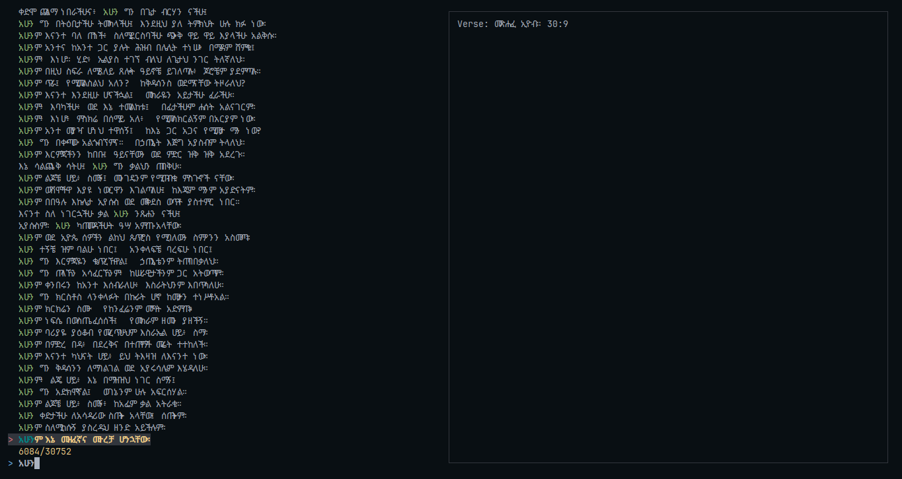

# 🕊️✝📖 Bibfezf 🕊️✝📖

> Amharic Bible Searching CLI Application




This is a CLI tool for searching the entire Amharic bible in Amharic and from our terminal I think as a developer we love our terminal. Do you want to search the bible from your terminal? or Do you want to add some bible verses to your project? here you go with **bibfezf** you can do both

## Installation

For installing and using the CLI you need to install golang first and have it in your path and then simply execute

```sh
go install github.com/hunderaweke/bibfezf@latest
```

after this finishes simple run

```sh
bibfezf
```

and the TUI will popup 😁 I appreciate you to share it to others 🙏 since it means a lot if God wishes I will provide a whole bible TUI and we will go to GUI soon

## Features

- fuzzy finding
- fzf like user interface
- works on all platforms where go is installed

## Todo

- Complete CLI for the bible
- Building GUI interface with easy installation
